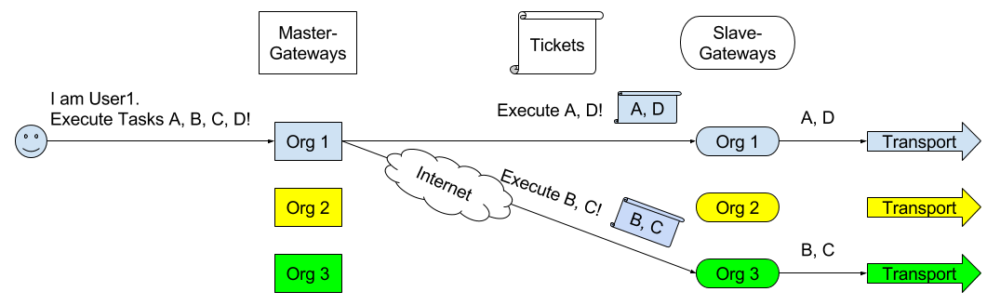

Installation
**************

Dependencies
#############

- Golang

Configuration
#################

Before going into detail about configuration options for Holmes-Gateway, you
need a good understanding how it works.
Take a look at the following picture:

As you can see, users interact with master gateways. When a user submits a task
to a master gateway, it creates a ticket and sends it to the appropriate slave gateway.
Which in turn pushes the task on the appropriate AMQP queue.
The reason for this architecture is that it enables sharing of sources and services
with other organizations, whilst enabling access control on two layers.

Each organization:

- has full control which organizations can submit tickets, based on their slave gateway settings
- has full control which users can submit tasks, based on their master gateway settings

.. note::

  The following configuration options for Holmes-Gateway might have misleading
  names, if you are not aware of their functionality.
  Be sure to read the descriptions carefully and look at the examples.

Holmes-Gateway is configured by the files found in ``config/``.
The ``gateway-master.conf`` configures master instances of Gateway, whilst the
``gateway.conf`` configures the slave instances.

Configuration options for a Slave Gateway:

+---------------------+----------------------------------------------------------------+---------------------------------------------------------------------------------------+
| Config-Key          | Value-Type                                                     | Description                                                                           |
+=====================+================================================================+=======================================================================================+
| HTTP                | ``String``                                                     | HTTP address to listen to.                                                            |
+---------------------+----------------------------------------------------------------+---------------------------------------------------------------------------------------+
| SourcesKeysPath     | ``String``                                                     | | The path to search for source public keys.                                          |
|                     |                                                                | | Keys in here must be in the PEM format and have ``.pub`` as their file extension.   |
+---------------------+----------------------------------------------------------------+---------------------------------------------------------------------------------------+
| TicketKeysPath      | ``String``                                                     | The Slave Gateway holds the public key associated with the Master Gateways private    |
|                     |                                                                | key. It is used to verify that a ticket was really sent by the Master Gateway.        |
+---------------------+----------------------------------------------------------------+---------------------------------------------------------------------------------------+
| SampleStorageURI    | ``String``                                                     | Address of a Holmes-Storage instance, e.g.: ``http://127.0.0.1:8016/samples/``.       |
+---------------------+----------------------------------------------------------------+---------------------------------------------------------------------------------------+
| AllowedTasks        | ``Object{String->List[String]}``                               | JSON object mapping organization identifiers to lists of services that the respective |
|                     |                                                                | organization may execute. Wildcard ``*`` means all services are allowed.              |
+---------------------+----------------------------------------------------------------+---------------------------------------------------------------------------------------+
| RabbitURI           | ``String``                                                     | Address of the RabbitMQ (or other AMQP broker).                                       |
+---------------------+----------------------------------------------------------------+---------------------------------------------------------------------------------------+
| RabbitUser          | ``String``                                                     | Username to use for AMQP                                                              |
+---------------------+----------------------------------------------------------------+---------------------------------------------------------------------------------------+
| RabbitPassword      | ``String``                                                     | Password to use for AMQP                                                              |
+---------------------+----------------------------------------------------------------+---------------------------------------------------------------------------------------+
| RabbitDefault       | ``Object``                                                     | JSON object with the following entries:                                               |
|                     |                                                                |                                                                                       |
|                     |                                                                | +-------------+------------------+--------------------------------------------------+ |
|                     |                                                                | | Queue       | String           | Name of the AMQP queue to use                    | |
|                     |                                                                | +-------------+------------------+--------------------------------------------------+ |
|                     |                                                                | | Exchange    | String           | Name of the AMQP exchange to use                 | |
|                     |                                                                | +-------------+------------------+--------------------------------------------------+ |
|                     |                                                                | | RoutingKey  | String           | Name of the AMQP routing key to use              | |
|                     |                                                                | +-------------+------------------+--------------------------------------------------+ |
+---------------------+----------------------------------------------------------------+---------------------------------------------------------------------------------------+
| Rabbit              | ``Object{String->Object}``                                     | Routing settings per service. Key is the service name (uppercase), value a JSON object|
|                     |                                                                | with the same key-value pairs as the RabbitDefault setting                            |
+---------------------+----------------------------------------------------------------+---------------------------------------------------------------------------------------+

Example:

.. code-block:: json

  {
    "HTTP":               ":8080",
    "SourcesKeysPath":    "config/keys/sources/",
    "TicketKeysPath":     "config/keys/tickets/",
    "SampleStorageURI":   "http://localhost:8016/samples/",
    "AllowedTasks":       {"org1": ["*"], "org2": ["PEINFO"]},
    "RabbitURI":          "localhost:5672/",
    "RabbitUser":         "guest",
    "RabbitPassword":     "guest",
    "RabbitDefault":      {"Queue": "totem_input", "Exchange": "totem", "RoutingKey": "work.static.totem"},
    "Rabbit":             {"CUCKOO":     {"Queue": "totem_dynamic_input", "Exchange": "totem_dynamic", "RoutingKey": "work.static.totem"},
                             "DRAKVUF":    {"Queue": "totem_dynamic_input", "Exchange": "totem_dynamic", "RoutingKey": "work.static.totem"},
                             "VIRUSTOTAL": {"Queue": "totem_dynamic_input", "Exchange": "totem_dynamic", "RoutingKey": "work.static.totem"}}
  }

Configuration options for a Master Gateway:

+---------------------+----------------------------------------------------------------+---------------------------------------------------------------------------------------+
| Config-Key          | Value-Type                                                     | Description                                                                           |
+=====================+================================================================+=======================================================================================+
| HTTP                | ``String``                                                     | HTTP address to listen to.                                                            |
+---------------------+----------------------------------------------------------------+---------------------------------------------------------------------------------------+
| SourcesKeysPath     | ``String``                                                     | | The path to search for source public keys.                                          |
|                     |                                                                | | Keys in here must be in the PEM format and have ``.pub`` as their file extension.   |
+---------------------+----------------------------------------------------------------+---------------------------------------------------------------------------------------+
| TicketSignKeyPath   | ``String``                                                     | Path to the private key of the gateway used for signing tickets.                      |
+---------------------+----------------------------------------------------------------+---------------------------------------------------------------------------------------+
| StorageURI          | ``String``                                                     | Address of a Holmes-Storage instance, e.g.: ``http://127.0.0.1:8016/samples/``.       |
+---------------------+----------------------------------------------------------------+---------------------------------------------------------------------------------------+
| RabbitURI           | ``String``                                                     | Address of the RabbitMQ server (or other AMQP broker).                                |
+---------------------+----------------------------------------------------------------+---------------------------------------------------------------------------------------+
| RabbitUser          | ``String``                                                     | Username to use for AMQP                                                              |
+---------------------+----------------------------------------------------------------+---------------------------------------------------------------------------------------+
| RabbitPassword      | ``String``                                                     | Password to use for AMQP                                                              |
+---------------------+----------------------------------------------------------------+---------------------------------------------------------------------------------------+
| RabbitDefault       | ``Object``                                                     | JSON object with the following entries:                                               |
|                     |                                                                |                                                                                       |
|                     |                                                                | +-------------+------------------+--------------------------------------------------+ |
|                     |                                                                | | Queue       | String           | Name of the AMQP queue to use                    | |
|                     |                                                                | +-------------+------------------+--------------------------------------------------+ |
|                     |                                                                | | Exchange    | String           | Name of the AMQP exchange to use                 | |
|                     |                                                                | +-------------+------------------+--------------------------------------------------+ |
|                     |                                                                | | RoutingKey  | String           | Name of the AMQP routing key to use              | |
|                     |                                                                | +-------------+------------------+--------------------------------------------------+ |
+---------------------+----------------------------------------------------------------+---------------------------------------------------------------------------------------+
| Rabbit              | ``Object{String->Object}``                                     | Routing settings per service. Key is the service name (uppercase), value a JSON object|
|                     |                                                                | with the same key-value pairs as the RabbitDefault setting                            |
+---------------------+----------------------------------------------------------------+---------------------------------------------------------------------------------------+
| AllowedUsers        | ``List[Object]``                                               | JSON list of JSON objects describing users and their logins. Each object is of the    |
|                     |                                                                | form:                                                                                 |
|                     |                                                                |                                                                                       |
|                     |                                                                | +-------------+------------------+--------------------------------------------------+ |
|                     |                                                                | |   Name      |   String         | Username                                         | |
|                     |                                                                | +-------------+------------------+--------------------------------------------------+ |
|                     |                                                                | |   Pw        |   String         | Password-Hash, Hashalgorithm: Blowfish.          | |
|                     |                                                                | +-------------+------------------+--------------------------------------------------+ |
|                     |                                                                | |   ID        |   Integer        | User-ID, must be unique.                         | |
|                     |                                                                | +-------------+------------------+--------------------------------------------------+ |
+---------------------+----------------------------------------------------------------+---------------------------------------------------------------------------------------+
| OwnOrganization     | ``String``                                                     | The identifier of your own organization.                                              |
+---------------------+----------------------------------------------------------------+---------------------------------------------------------------------------------------+
| Organizations       | ``List[Object]``                                               | JSON list of JSON objects describing an organization. Each object is of the form:     |
|                     |                                                                |                                                                                       |
|                     |                                                                | +-------------+------------------+--------------------------------------------------+ |
|                     |                                                                | |   Name      |   String         | Organizations name                               | |
|                     |                                                                | +-------------+------------------+--------------------------------------------------+ |
|                     |                                                                | |   Uri       |   String         | TODO                                             | |
|                     |                                                                | +-------------+------------------+--------------------------------------------------+ |
|                     |                                                                | |   Sources   |   List[String]   | Names of sources that this organization may      | |
|                     |                                                                | |             |                  | access                                           | |
|                     |                                                                | +-------------+------------------+--------------------------------------------------+ |
+---------------------+----------------------------------------------------------------+---------------------------------------------------------------------------------------+
| AutoTasks           | ``Object{String->Object{String->List[String]}}``               | Maps automatic execution instructions to filetypes. It is basically                   |
|                     |                                                                | Object[Filetype->Object[Servicename->Servicearguments]].                              |
|                     |                                                                |                                                                                       |
+---------------------+----------------------------------------------------------------+---------------------------------------------------------------------------------------+

Example:

.. code-block:: json

  {
    "HTTP":              ":8090",
    "SourcesKeysPath":   "config/keys/sources/",
    "TicketSignKeyPath": "config/keys/tickets/org1.priv",
    "Organizations":     [{"Name": "Org1", "Uri": "http://localhost:8080/task/", "Sources": ["src1","src2"]},
                          {"Name": "Org2", "Uri": "http://localhost:8081/task/", "Sources": ["src3"]}],
    "OwnOrganization":   "Org1",
    "AllowedUsers":      [{"name": "test", "pw":"$2a$06$fLcXyZd6xs60iPj8sBXf8exGfcIMnxZWHH5Eyf1.fwkSnuNq0h6Aa", "id":0},
                          {"name": "test2", "pw":"$2a$06$fLcXyZd6xs60iPj8sBXf8exGfcIMnxZWHH5Eyf1.fwkSnuNq0h6Aa", "id":1}],
    "StorageURI":        "http://localhost:8016/samples/",
    "AutoTasks":         {"PE32":{"PEINFO":[],"PEID":[]}, "":{"YARA":[]}},
    "CertificateKeyPath":"cert-key.pem",
    "CertificatePath":   "cert.pem"
    "MaxUploadSize":     200
  }

In addition to the regular config files, Holmes-Gateway requires RSA keys to
provide its services. The structure explained above requires these for security
reasons.

Two rules apply:

- Each sample source is assigned a key pair
- Each master gateway is assigned a key pair

The procedure when a master gateway receives a tasking request is as follows:

1. It checks if the user is allowed
2. It checks if it possesses the public key associated with the requested source
3. It creates a ticket
4. It encrypts the task in the ticket using the public key of the source
5. It signs the ticket using its private key
6. It sends the ticket to the target slave gateway

The receiving slave gateway follows these steps:

1. It checks if it possesses the public key of the master gateway
2. It verifies the signature of the request using that public key
3. It checks if it possesses the private key of the source
4. It decrypts the task
5. It relays the task to the transport (AMQP)

As a result, these rules apply:

- A master gateway will reject creation of tickets if the user is not allowed or
  if it misses the appropriate public key (key of the source)
- A slave gateway will reject tickets that it cannot verify or decrypt
- Keys must be named accurately
  - source keys must be named exactly as the corresponding source
  - organization keys must be named exactly like the corresponding organization
  - all keys must have the appropriate ``.priv`` or ``.pub`` suffix

In summary, a master gateway requires:

- A keypair for signing requests
- The public keys of all sources it should have access to

A slave gateway requires:

- The public keys of all master gateways that are allowed to send tickets
- The private keys of all sources it should have access to

All the required keys can be created using e.g. the OpenSSL libraries.

.. note::

  Only unencrypted RSA keys in the PEM format are supported.

For ease of use, we distribute a small convenience program that creates 2048-bit keys for
you. After git cloning ``https://github.com/HolmesProcessing/Holmes-Gateway.git``
open the repository folder in a terminal and do:

.. code-block:: shell

  cd config/keys
  go build

Now you can use ``./keys <path>`` to create said keys.
For example, to create the master gateway key use:

.. code-block:: shell

  ./keys tickets/org_holmesprocessing

This will create a keypair (``org_holmesprocessing.priv`` and ``org_holmesprocessing.pub``)
in ``config/keys/tickets``.

Similarly, if you execute:

.. code-block:: shell

  ./keys sources/source_holmesprocessing

You will get the files ``source_holmesprocessing.priv`` and ``source_holmesprocessing.pub``
saved to ``config/keys/sources``.

.. note::

  Key changes are recognized at runtime, allowing for removal or addition of
  keys without system downtime.

.. The keys can be created using the script config/keys/generate_key.go

|

Installation
#################

Holmes-Gateway is the endpoint that users interact with when creating tasks for
Holmes-Totem or Holmes-Totem-Dynamic.

.. code-block:: shell

    mkdir -p /data/holmes-gateway
    cd /data/holmes-gateway
    git clone https://github.com/HolmesProcessing/Holmes-Gateway.git .
    go build .

The framework requires one Holmes-Gateway running in Master mode and the Master
Gateway needs an SSL certificate to function. If you don't have an SSL certificate
at hand, you can simply create a self-signed one by using the provided shell
script:

.. code-block:: shell

    ./mkcert.sh

|